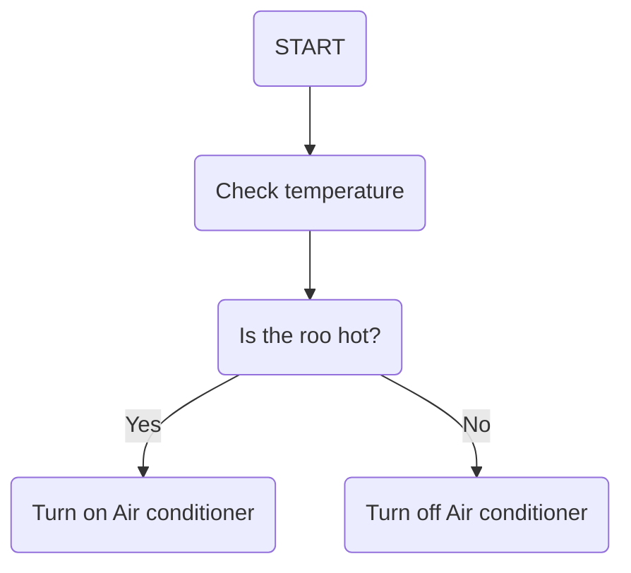

## Mermaid library




# MatJax
$$\ lambda = \frac {v}{f}$$

# vega-lite
```vega-lite
{
  "mark": "line",
  "data": {
    "url": "simple.csv"
  },
  "encoding": {
    "x": {
      "field": "time(s)",
      "type": "quantitative"
    },
    "y": {
      "field": "distance(m)",
      "type": "quantitative"
    } 
  }
}
```
also check out vega project

# sequence diagram

```mermaid
  sequenceDiagram
  MCU->>Sensor: Start
  MCU->>Sensor: Slave address
  Sensor->>MCU: Ack
  MCU->>Sensor: Data
  ```
